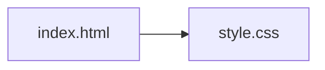
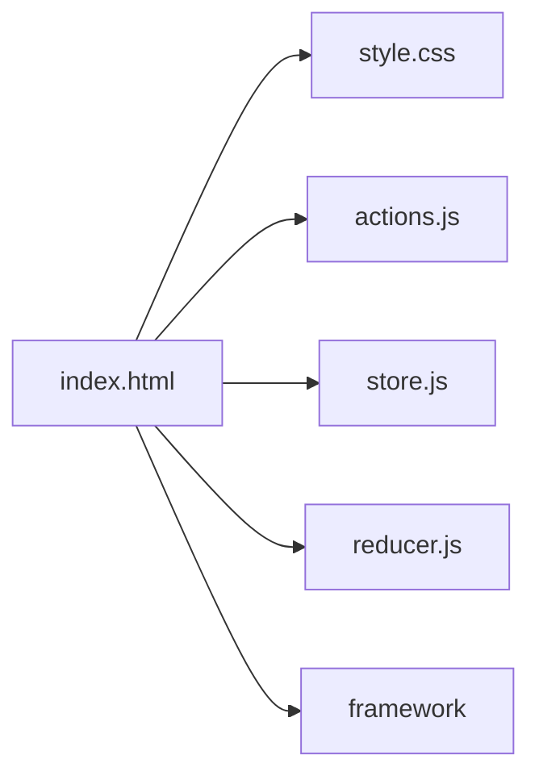
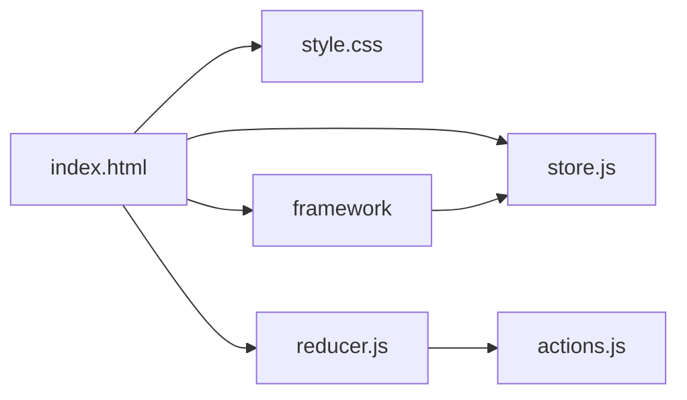

# How to Implement Redux in 24 Lines of JavaScript

[Original article](https://www.freecodecamp.org/news/redux-in-24-lines-of-code/) By Yazeed Bzadough. [Github repo](https://github.com/yazeedb/implement-redux-counter-app)

## Thoughts on the original code

1. All the JS source code is contained in the HTML file. I would prefer to break the code out into separate concerns.
2. Updating DOM elements and registering click events is normally something a JS framework would manage.
3. When configuring a REDUX store, we need to define three specific elements:
   - The Actions that can update state.
   - The Reducer that maintains the state.
   - The Store that conatins the state.

### Project file structure

## Mark One: Refactored

The code within the HTML file is extracted into JS files and reference using `script` elements.

The source code is split into four separate concerns:

- **store.js**, contains the `createStore` function.
- **actions.js**, contains the `actions` object, in a _frozen_ form, that contains values for `increment` and `decrement`.
- **reducer.js**, contains the `countReducer` function that retains use of a switch statement.
- **framework.js** supplies the `wireUpDom` functon that:
  - registers the buttons with click event handels
  - subscribes all elements with a `data-value` attribute to the store.

There remaining JS code, stays in the HTML file, includes:

- `const initialState = { count: 0 };`
- `const store = createStore(countReducer, initialState);`
- `wireUpDom(store);`

The `script` elements and the above JS code are interleaved to align with the original example but this will change in the next.

### Project file structure

## Mark Two: Modernised

The CSS and HTML files remain unchanged with the exception of the JavaScript. The four files are converted from regular JS files to ES6 modules, of which three (store, reducer, framework) are imported into the HTML file. The fourth file (actions) is imported by the reducer file.

The `store.js` file (module) exposes the original `createStore` function but, when called, it only provides the `dispatch` method and a `state` getter. A `subscribe` function is also exposed that is used by the `framework` module to wire up the DOM elements.

The rest of the JS code in the HTML file is called after the imports but are otherwise unchanged.

### Project file structure

